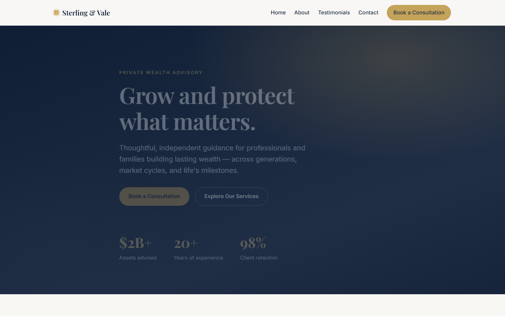

# Sterling & Vale Advisory

A single-page marketing website for **Sterling & Vale Advisory**, a fictional wealth-management firm. Built with vanilla HTML, CSS, and JavaScript — no frameworks, no build tools, no package manager. Google Fonts is the only external dependency.

🌐 **Live site:** https://wendyhow005.github.io/wealth/



## Features

- **Responsive, mobile-first design** with breakpoints at 640px, 860px, and 980px
- **Smooth-scroll navigation** with a collapsible mobile menu
- **Scroll-in reveal animations** powered by `IntersectionObserver`
- **Auto-playing testimonial carousel** with dot navigation
- **Enquiry form** that submits via AJAX (FormSubmit) without a page redirect
- **Accessibility-conscious**: respects `prefers-reduced-motion`, semantic markup, ARIA on nav and carousel, visible focus styles

## Project structure

| File | Purpose |
| --- | --- |
| `index.html` | Semantic page structure — Hero → Services → Testimonials → Contact |
| `styles.css` | All styling; theming driven by `:root` custom properties, mobile-first layout |
| `script.js` | One IIFE: navbar state, mobile menu, scroll reveals, carousel, enquiry form, footer year |

## Running locally

There is no build step. Open `index.html` directly in a browser, or serve it statically to avoid `file://` quirks:

```bash
python -m http.server
```

Then visit http://localhost:8000.

## Enquiry form (FormSubmit)

The form submits via **FormSubmit's AJAX endpoint** using `fetch()`, so the page never redirects.

- The endpoint is the `FORM_ENDPOINT` constant in `script.js` (look for the `REPLACE_WITH_YOUR_EMAIL` comment).
- **One-time activation:** the *first* submission to a new email address triggers a confirmation email from FormSubmit. The form only delivers messages **after** that activation link is clicked.
- Spam protection: a hidden `_honey` honeypot field plus `_captcha: "false"`.

## Deployment

The site deploys automatically to **GitHub Pages** via GitHub Actions. Every push to the `main` branch triggers the workflow in [`.github/workflows/deploy.yml`](.github/workflows/deploy.yml), which publishes the repository root to Pages.

To publish a change:

```bash
git add -A
git commit -m "describe your change"
git push
```

## Customization

- **Colors & spacing:** edit the custom properties in `:root` at the top of `styles.css`
- **Enquiry form email:** update `FORM_ENDPOINT` in `script.js`
- **Testimonials:** add or remove `<li class="slide">` items in `index.html` — the carousel dots and timing update automatically

## License

This is a demonstration project for a fictional company.
